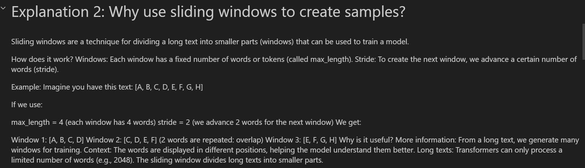
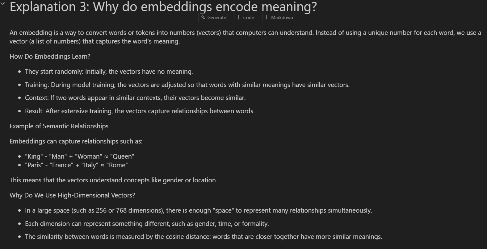

# TDSE_LLM_Text_Preprocessing_Foundations

## Embeddings and Text Preprocessing for LLMs

This repository contains an educational Jupyter notebook based on Chapter 2 of the book "Build a Large Language Model (From Scratch)" by Sebastian Raschka.

### Content

#### `embeddings.ipynb`
Complete notebook covering the foundations of text preprocessing for Large Language Models:

1. **Basic Tokenization and Byte Pair Encoding (BPE)**
   - Text to token conversion
   - Implementation with tiktoken (GPT-2)
   
2. **Data sampling with sliding window**
   - Training window creation
   - `max_length` and `stride` parameters
   
3. **Token embeddings**
   - Vector representations of tokens
   - Learnable embedding matrices
   
4. **Positional encodings**
   - Incorporating position information
   - Absolute and relative encodings

5. **Experiment: Effect of max_length and stride**
   - Practical parameter analysis
   - Results visualization

####  `the-verdict.txt`
Sample text file used in the notebook for demonstration.

### Special Features

-  
-  
-  
- 

- NOTA: para mirar a detalle revisar el `Explicacion.ipynb`

### Requirements

```bash
pip install torch tiktoken pandas jupyter
```

### Usage

```bash
jupyter notebook embeddings.ipynb
```

### Notebook Structure

```
Introduction
├── Explanation 1: Tokenization
├── Explanation 2: Sliding Window
├── Explanation 3: Embeddings
├── Explanation 4: Positional Encodings
└── Experiment: max_length and stride
```

### References

- Book: "Build a Large Language Model (From Scratch)" - Sebastian Raschka
- Original repository: https://github.com/rasbt/LLMs-from-scratch
- Chapter 2: https://github.com/rasbt/LLMs-from-scratch/tree/main/ch02